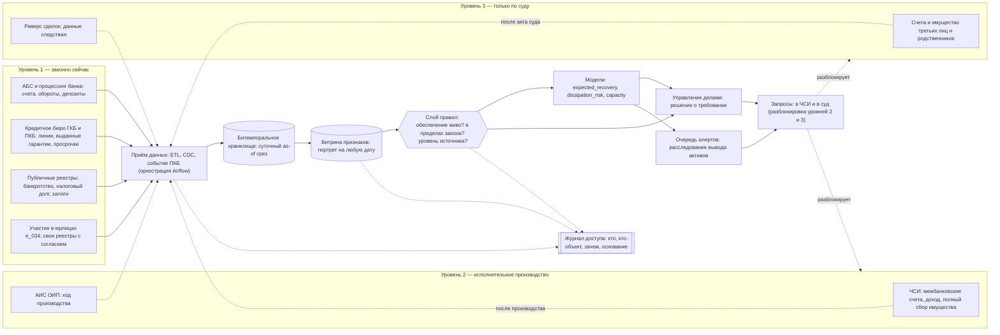
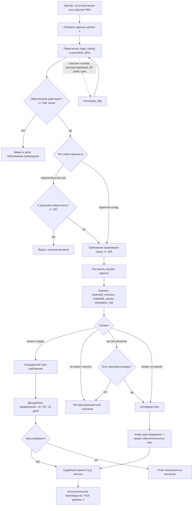
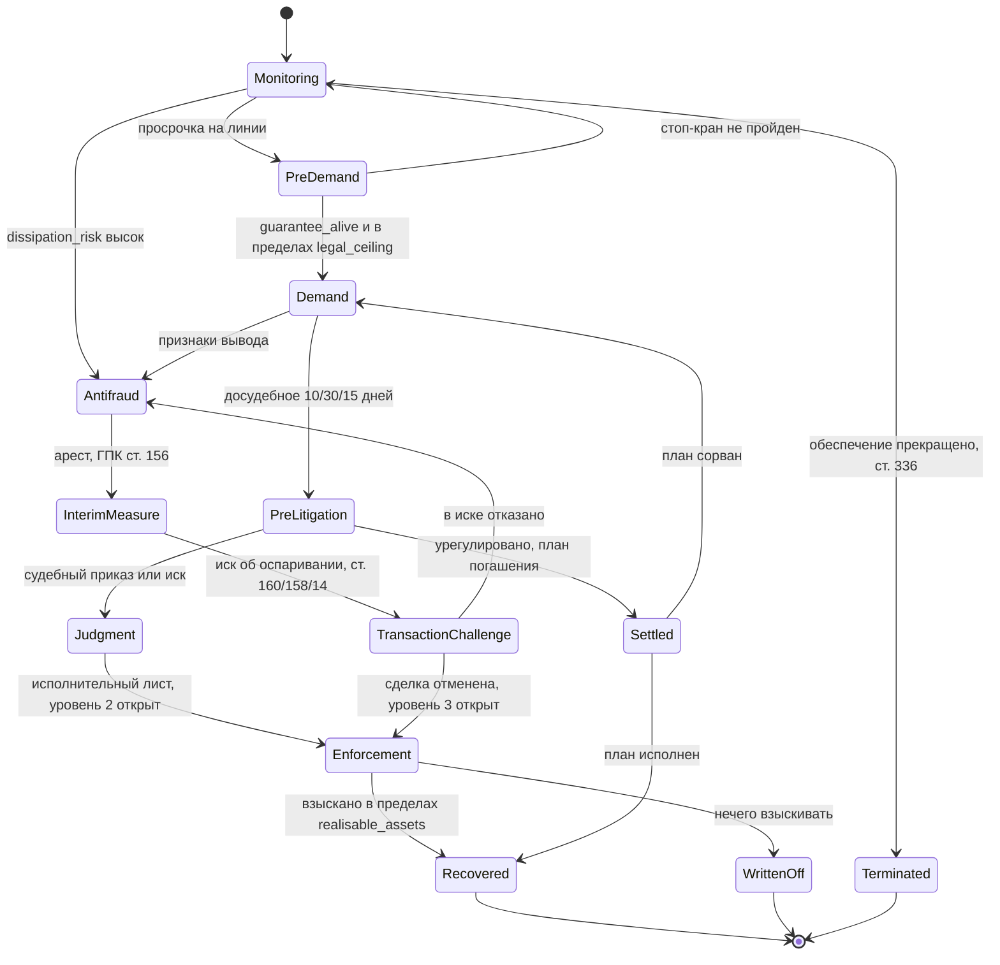
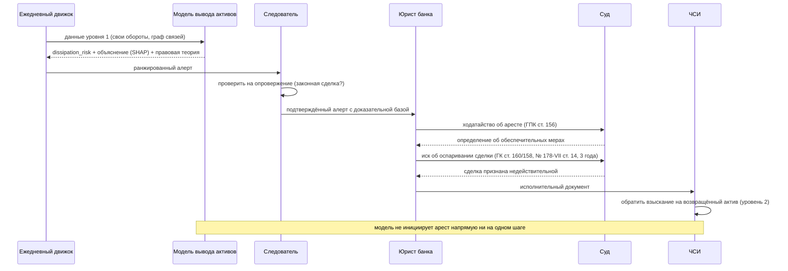
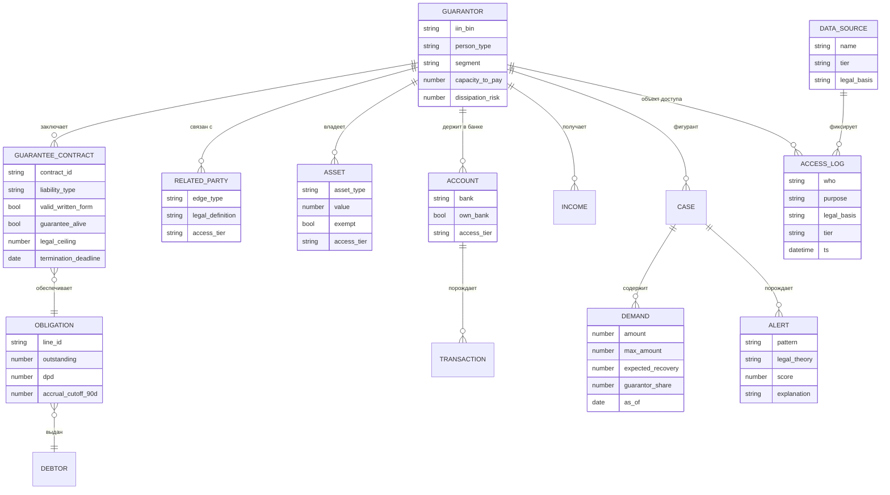
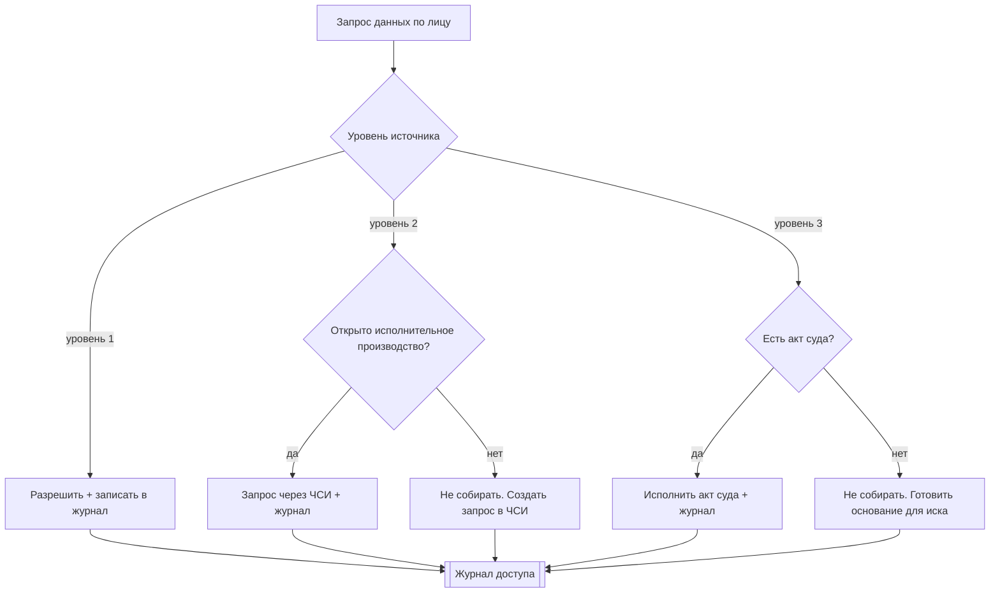

# Проект «Гаранты»: схемы процесса (UML)

Шесть взаимодополняющих представлений одной системы. Диаграммы на **Mermaid** —
рендерятся в предпросмотре Markdown в VS Code (расширение Markdown Preview Mermaid Support) и
на GitHub. Для строгого UML те же две ключевые диаграммы продублированы в **PlantUML**
(`component.puml`, `activity.puml`) — рендер на plantuml.com или через расширение PlantUML.

Через все схемы проходит одна идея: **правовое основание — это управляющий поток, а не сноска.**
Данные движутся снизу вверх по уровням доступа (1 → 2 → 3), и каждый переход разблокируется
юридическим событием (согласие, исполнительное производство, акт суда), а не технической
возможностью.

Соответствие разделам методологии (`../methodology_skill.md`): маска уровней — раздел 3; источники
— раздел 4; целевые величины — раздел 5; портрет — раздел 6; пересчёт — раздел 7; максимум и доля —
раздел 8; антифрод — раздел 9; граф связей — раздел 10; архитектура — раздел 11.

---

## 1. Контекст и компоненты: откуда данные, куда решения

Источники сгруппированы по уровню доступа. Всё, что выше уровня 1, входит в систему не как
собранные данные, а как **обоснованный запрос**. Журнал доступа — сквозной.

---

## 2. Ежедневный цикл мониторинга: правовые шлюзы как узлы решения

Порядок неслучаен: сначала правовые стоп-краны (дёшево и решает правомерность), потом дорогая
аналитика. Требование не формируется, пока не пройдены оба шлюза.

---

## 3. Жизненный цикл дела гаранта (конечный автомат)

Показывает, как переходы разблокируют уровни доступа к данным и как антифрод-ветвь вплетается в
основной поток.

---

## 4. От сигнала вывода активов к взысканию (последовательность)

Ключевая идея: модель **ранжирует и объясняет**, действуют человек и суд. Автоматического ареста
нет ни на одном шаге.

---

## 5. Модель данных (ER)

Ядро сущностей. `ACCESS_LOG` и `DATA_SOURCE.tier` делают законность частью самой схемы данных.

---

## 6. Шлюз правовых оснований (детально)

Один и тот же шлюз стоит на каждом обращении к данным. Он либо пропускает и пишет в журнал, либо
превращает запрос в юридическое действие.

---

## Замечание о творческой части

Смысловой ход проекта в том, что **право сделано управляющим контуром системы, а не комментарием
к ней.** Тот же граф связей, что ищет выведенные активы, служит и движком доли (кто ещё солидарно
обязан) и движком регресса (к кому перейдёт право после уплаты, ст. 334). Те же события, что
запускают пересчёт суммы, продвигают конечный автомат дела. А единственный способ поднять данные с
уровня 2 или 3 — совершить юридическое действие, поэтому «найти счета в других банках» и «имущество
родственников» превращаются из соблазна нарушить тайну в законный запрос с доказательной базой,
которую та же система и подготовила.
